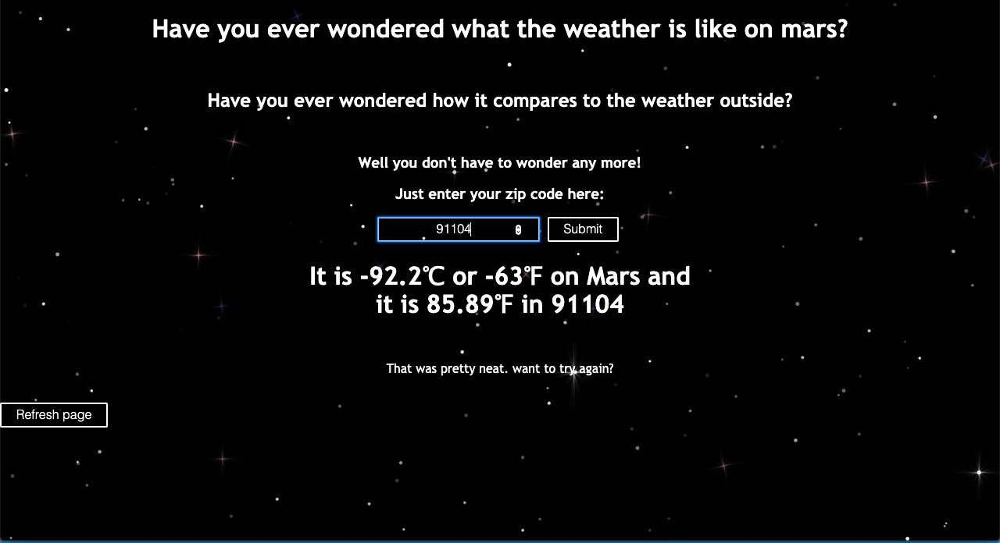

<!-- TODO https://guides.github.com/features/mastering-markdown/ read this! -->

# Get some space 
## A mars and earth weather comparison app 

https://mlittle5.github.io/API-hack-project/

Format: 

Have you ever wondered what the weather is like on mars?
Have you ever wondered how it compares to the weather outside?

Well you don't have to wonder any more!
Just enter your zip code and see!

This app shows you the weather on Mars and allow you to input a zip code to get the weather of that location. It displays the temperature in both Fahrenheit and Celsius. 

# Technology used:
1. javascript
1. jQuery
1. HTML
1. CSS

# API's used:
1. InSight: Mars Weather Service API from NASA
    1. gets the weather from mars
1. Current Weather Data from Openweather
    1. get the weather based on the location of a zip code. 
